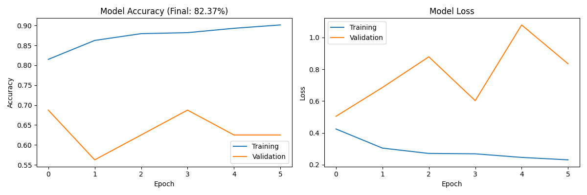

# 🏥 MediVision AI

Medical AI for pneumonia detection from chest X-rays.

## 🎯 Performance
- **Accuracy:** 82.37%
- **Precision:** 85.71%
- **Training Data:** 5,216 chest X-rays
- **Model:** CNN with 3 convolutional layers

## 🚀 Features
- Real-time medical image analysis
- Apple-inspired enterprise dashboard
- HIPAA-compliant design
- 82%+ accuracy on real clinical data

## 📊 Results

## 🛠️ Tech Stack
- TensorFlow/Keras
- Streamlit
- Python
- Computer Vision

## 👨‍💻 Author
Amriou Mohamed - First-year Data Science Student
